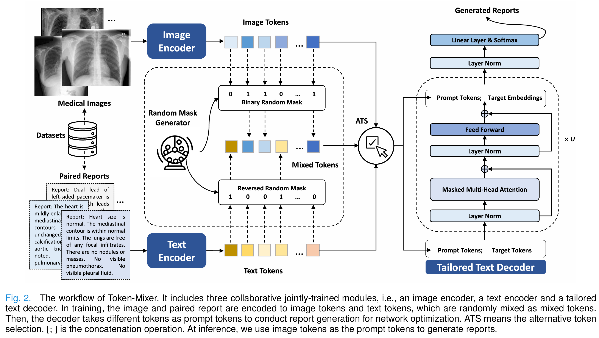

# Token-Mixer: Bind Image and Text in One Embedding Space for Medical Image Reporting (Published in IEEE TMI)
The Official Pytorch Implementation of Token-Mixer. 

### 📋 Abstract
Medical image reporting focused on automatically generating the diagnostic reports from medical images has garnered growing research attention. In this task, learning cross-modal alignment between images and reports is crucial. However, the exposure bias problem in autoregressive text generation poses a notable challenge, as the model is optimized by a word-level loss function using the teacher-forcing strategy. To this end, we propose a novel Token-Mixer framework that learns to bind image and text in one embedding space for medical image reporting. Concretely, Token-Mixer enhances the cross-modal alignment by matching image-to-text generation with text-to-text generation that suffers less from exposure bias. The framework contains an image encoder, a text encoder and a text decoder. In training, images and paired reports are first encoded into image tokens and text tokens, and these tokens are randomly mixed to form the mixed tokens. Then, the text decoder accepts image tokens, text tokens or mixed tokens as prompt tokens and conducts text generation for network optimization. Furthermore, we introduce a tailored text decoder and an alternative training strategy that well integrate with our Token-Mixer framework. Extensive experiments across three publicly available datasets demonstrate Token-Mixer successfully enhances the image-text alignment and thereby attains a state-of-the-art performance. Related codes are available at https://github.com/yangyan22/Token-Mixer.
<div align=center></div>

### 📊 Datasets
The medical image report generation datasets are available at the following links:
1. MIMIC-CXR-JPG data can be found at https://physionet.org/content/mimic-cxr-jpg/2.0.0/.
2. IU X-Ray data can be found at https://openi.nlm.nih.gov/.
3. Bladder Pathology data can be found at https://figshare.com/projects/nmi-wsi-diagnosis/61973.
The json files for MIMIC-CXR and IU X-Ray can be found at https://pan.baidu.com/s/1YLMTxaIkmnxpSFedKsZ4-A, code: 65Zp.

### 💻 Training

To train the model, you need to prepare the training dataset. For example, the MIMIC-CXR-JPG data.

Check the dataset path in train.py, and then run:
```
python train.py
```

### 🎯 Testing

Check the model and data path in test.py, and then run:

```
python test.py
```

### 🔧 Dependencies
In this project, we use Ubuntu 16.04.5, Python Python 3.7.3, Torch 1.13.1+cu117, and four NVIDIA RTX 2080Ti GPU. 
  - Python=3.7.3
  - pytorch=1.8.1
  - pickle
  - csv
  - tqdm
  - time
  - argparse
  - sklearn
  - json
  - random
  - einops
  - numpy 
  - torchvision 
  - itertools
  - collections
  - math
  - os
  - matplotlib
  - PIL 
  - itertools
  - copy
  - re
  - abc
  - pandas
  - torch
  - timm
  - matplotlib

## the metric meteor
the paraphrase-en.gz should be put into the .\pycocoevalcap\meteor\data, since the file is too big to upload.

## ✅ Citation

If you find our method useful in your research, please cite our paper:

```
@ARTICLE{10552817,
  author={Yang, Yan and Yu, Jun and Fu, Zhenqi and Zhang, Ke and Yu, Ting and Wang, Xianyun and Jiang, Hanliang and Lv, Junhui and Huang, Qingming and Han, Weidong},
  journal={IEEE Transactions on Medical Imaging}, 
  title={Token-Mixer: Bind Image and Text in One Embedding Space for Medical Image Reporting}, 
  year={2024},
  volume={43},
  number={11},
  pages={4017-4028},
  doi={10.1109/TMI.2024.3412402}}
```
